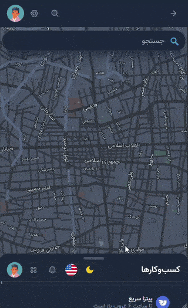

# @balalarast/vue-bottom-sheet

[](https://www.npmjs.com/package/@balalarast/vue-bottom-sheet)
[](https://github.com/balalarast/vue-bottom-sheet/actions)
[](https://www.npmjs.com/package/@balalarast/vue-bottom-sheet)
[](https://www.npmjs.com/package/@balalarast/vue-bottom-sheet)
[](https://vue-bottom-sheet-alpha.vercel.app/)
[]()

Bottom Sheet component for Vue 3, Nuxt 3, and Nuxt 4 with drag support, multiple snap points, and dark mode.  
Built with [@oku-ui/motion](https://motion.oku-ui.com) for smooth and performant animations.

## Table of Contents

- [Compatibility](#compatibility)
- [Features](#features)
- [Demo](#demo)
- [Install](#install)
- [Usage in Vue 3](#usage-in-vue-3)
  - [1. Registering the Component Globally (Recommended)](#1-registering-the-component-globally-recommended)
  - [2. Direct Import in Components](#2-direct-import-in-components)
- [Usage in Nuxt 3 & Nuxt 4](#usage-in-nuxt-3--nuxt-4)
  - [1. Using Nuxt Module (Recommended)](#1-using-nuxt-module-recommended)
  - [2. Registering the Component in Plugins](#2-registering-the-component-in-plugins)
  - [3. Direct Import in Components](#3-direct-import-in-components)
- [Props and Configuration](#props-and-configuration)
- [Exposed Methods & Properties](#exposed-methods--properties)
- [Events](#events)
- [Styling guide](#styling-guide)
- [Running Playground](#running-playground)
- [Running Tests](#running-tests)

## Compatibility

This package is fully compatible with:
- Vue 3
- Nuxt 3
- Nuxt 4

## Features

- Smooth open and close animations powered by [@oku-ui/motion](https://motion.oku-ui.com)
- Support for multiple snap points (percentage and pixel values)
- Drag support with adjustable panel height
- Dark mode support
- Prevent pull-to-refresh on mobile devices
- Ability to use teleport for rendering in custom locations

## Demo

You can try the live demo here:  

👉 [Live Demo in vercel](https://vue-bottom-sheet-alpha.vercel.app/)  
👉 [Live Demo in CodeSandbox](https://rhwgsx-3000.csb.app/)  
👉 [Open in CodeSandbox](https://codesandbox.io/embed/quizzical-napier-rhwgsx?view=preview)





## Install

```bash
npm install @balalarast/vue-bottom-sheet
# or
yarn add @balalarast/vue-bottom-sheet
```

## Usage in Vue 3

### 1. Registering the Component Globally (Recommended)

If you prefer to register the component globally, create a file like plugins/bottom-sheet.ts and register it:

```ts
import { createApp } from 'vue'
import BottomSheet from '@balalarast/vue-bottom-sheet'

export default (app: ReturnType<typeof createApp>) => {
  app.component('BottomSheet', BottomSheet)
}
```

Then you can use it in any component without importing:

```ts
<script setup lang="ts">
import { ref } from 'vue'

const sheetRef = ref(null)

function openSheet() {
  sheetRef.value?.open()
}
</script>

<template>
  <button @click="openSheet">Open Bottom Sheet</button>
  <BottomSheet ref="sheetRef" />
</template>
```

---

### 2. Direct Import in Components

```ts
<script setup lang="ts">
import BottomSheet from '@balalarast/vue-bottom-sheet'
import { ref } from 'vue'

const sheetRef = ref<InstanceType<typeof BottomSheet>>()

function openSheet() {
  sheetRef.value?.open()
}
</script>

<template>
  <button @click="openSheet">Open Bottom Sheet</button>
  <BottomSheet ref="sheetRef" />
</template>
```

## Usage in Nuxt 3 & Nuxt 4

You can use **any one** of the following methods — choose the one that best fits your project setup.

### 1. Using Nuxt Module (Recommended)

If you have enabled the Nuxt module, make sure to add it in your `nuxt.config.ts` like this so that the component is automatically available throughout your project:

```ts
export default defineNuxtConfig({
  modules: [
    '@balalarast/vue-bottom-sheet/nuxt'
  ],
})
```

Using the Component in Your Vue Files:

```ts
<script setup lang="ts">
const sheetRef = ref(null)

function openSheet() {
  sheetRef.value?.open()
}
</script>

<template>
  <button @click="openSheet">Open Bottom Sheet</button>
  <BottomSheet ref="sheetRef" />
</template>
```

---

### 2. Registering the Component in Plugins

If you prefer manual registration, you can create a Nuxt plugin file (e.g., plugins/bottom-sheet.client.ts) and register the BottomSheet component globally.
This way, the component will be available in all your Vue components without the need to import it individually.

```ts
import { defineNuxtPlugin } from '#app'
import BottomSheet from '@balalarast/vue-bottom-sheet'

export default defineNuxtPlugin(nuxtApp => {
  nuxtApp.vueApp.component('BottomSheet', BottomSheet)
})
```

Using the Component in Your Vue Files:

```ts
<script setup lang="ts">
const sheetRef = ref(null)

function openSheet() {
  sheetRef.value?.open()
}
</script>

<template>
  <button @click="openSheet">Open Bottom Sheet</button>
  <BottomSheet ref="sheetRef" />
</template>
```

---

### 3. Direct Import in Components

You can import and use the component directly inside your components:

```ts
<script setup lang="ts">
import BottomSheet from '@balalarast/vue-bottom-sheet'

const sheetRef = ref<InstanceType<typeof BottomSheet>>()

function openSheet() {
  sheetRef.value?.open()
}
</script>

<template>
  <button @click="openSheet">Open Bottom Sheet</button>
  <BottomSheet ref="sheetRef" />
</template>
```

## Props and Configuration
| Prop Name                 | Type                         | Default                | Description |
|----------------------------|------------------------------|------------------------|-------------|
| `darkMode`                | `boolean`                    | `false`                | Enables dark mode styling. |
| `canSwipeClose`           | `boolean`                    | `true`                 | Allows closing the sheet by swiping down. |
| `snapPoints`              | `Array<number \| string>`    | `[200, '60%', '90%']`  | Snap points as percentages or pixel values. |
| `initialSnapPoint`        | `number`                     | `0`                    | Initial snap point index. |
| `overlay`                 | `boolean`                    | `true`                 | Shows a dark overlay behind the sheet. |
| `teleportTo`              | `string`                     | `'body'`               | Element selector for teleport rendering. |
| `containerClass`          | `string`                     | `''`                   | Additional CSS class for the sheet container. |
| `hideScrollbar`           | `boolean`                    | `false`                | Hides the scrollbar inside the sheet. |
| `preventPullToRefresh`    | `boolean`                    | `true`                 | Prevents pull-to-refresh on mobile devices. |
| `expandOnContentDrag`     | `boolean`                    | `false`                | Allows the sheet to expand when dragging content. |
| `edgeScrollSnap`          | `boolean`                    | `true`                 | Enables snapping to next/previous snap point when scrollable content is at top or bottom (works only if `expandOnContentDrag` is `false`). |
| `disableEdgeBounce`       | `boolean`                    | `false`                | Disables bounce effect at edges when dragging beyond min/max limits. |
| `smoothFactor`            | `number`                     | `0.7`                  | Smoothing factor for height animation. |
| `animationDuration`       | `number`                     | `150`                  | Duration of open/close animation in milliseconds. |
| `minDragDistance`         | `number`                     | `5`                    | Minimum distance for drag to trigger snap. |
| `fastSwipeVelocity`       | `number`                     | `100`                  | Velocity threshold for fast swipe to next snap point. |
| `fastSwipeMaxTapTime`     | `number`                     | `200`                  | Maximum duration for a fast swipe to trigger. |
| `closeMinDragDistance`    | `number`                     | `5`                    | Minimum distance dragged to trigger close intent. |
| `closeMaxTapTime`         | `number`                     | `200`                  | Maximum time for tap to consider close intent. |
| `closeRelativeThreshold`  | `number`                     | `0.2`                  | Relative distance threshold for swipe-to-close. |
| `fastClose`               | `boolean`                    | `false`                | Enables fast swipe-to-close behavior. |
| `fastCloseMode`           | `'default' \| 'maxSnap' \| function` | `'default'` | Mode to determine how fastClose behaves. |
| `fastCloseVelocity`       | `number`                     | `100`                  | Minimum velocity to trigger fastClose. |
| `fastCloseVelocityGrace`  | `number`                     | `40`                   | Extra allowance for fastClose velocity. |

## Exposed Methods & Properties
This component exposes several methods and properties via `ref` so you can control it programmatically.

| Name | Type | Description |
|------|------|-------------|
| `open()` | `Promise<void>` | Opens the Bottom Sheet to the initial snap point or the one specified in `initialSnapPoint`. |
| `close()` | `Promise<void>` | Closes the Bottom Sheet with an animation. |
| `snapToPoint(index: number)` | `void` | Moves the Bottom Sheet to the snap point at the given index (based on the `snapPoints` array). |
| `isOpened` | `ComputedRef<boolean>` | Indicates whether the Bottom Sheet is currently open (read-only). |
| `pixelSnapPoints` | `ComputedRef<number[]>` | Returns the calculated pixel values of all snap points. |
| `getOriginalIndex(sortedIndex: number)` | `number` | Returns the original index of a snap point before sorting, useful when `snapPoints` are not in order. |

<details>
<summary>Example</summary>

```bash
<script setup lang="ts">
import BottomSheet from '@balalarast/vue-bottom-sheet'
const sheetRef = ref<InstanceType<typeof BottomSheet>>()

function openSheet() {
  sheetRef.value?.open()
}

function closeSheet() {
  sheetRef.value?.close()
}

function goToSecondSnap() {
  sheetRef.value?.snapToPoint(1)
}

onMounted(() => {
  openSheet()
})
</script>

<template>
  <button @click="openSheet">Open</button>
  <button @click="closeSheet">Close</button>
  <button @click="goToSecondSnap">Go to 60%</button>

  <BottomSheet ref="sheetRef">
    <p>Your content here...</p>
  </BottomSheet>
</template>
```
</details>

## Events

| Event Name   | Parameters             | Description                                              |
|--------------|------------------------|----------------------------------------------------------|
| `open`       | `()`                   | Fired when the Bottom Sheet is fully opened.             |
| `close`      | `()`                   | Fired when the Bottom Sheet is closed.                    |
| `snapChange` | `(snapIndex: number)`  | Fired when the Bottom Sheet changes to a new snap point. |
| `dragStart`  | `()`                   | Fired when the user starts dragging the Bottom Sheet.    |
| `dragEnd`    | `(finalIndex: number)` | Fired when the user finishes dragging and the sheet settles at a snap point. |

<details>
<summary>Example</summary>

```bash
<script setup lang="ts">
import BottomSheet from '@balalarast/vue-bottom-sheet'
const sheetRef = ref<InstanceType<typeof BottomSheet>>()

function openSheet() {
  sheetRef.value?.open()
}

function closeSheet() {
  sheetRef.value?.close()
}

// Events
function handleOpen() {
  console.log('Bottom Sheet opened')
}

function handleClose() {
  console.log('Bottom Sheet closed')
}

function handleSnapChange(snapIndex: number) {
  console.log('Snap changed to index:', snapIndex)
}

function handleDragStart() {
  console.log('Drag started')
}

function handleDragEnd(finalIndex: number) {
  console.log('Drag ended at index:', finalIndex)
}
</script>

<template>
  <div class="p-4 space-x-2">
    <button @click="openSheet">Open</button>
    <button @click="closeSheet">Close</button>
  </div>

  <BottomSheet
    ref="sheetRef"
    :snap-points="[100, 300, '100%']"
    initial-snap-point="1"
    @open="handleOpen"
    @close="handleClose"
    @snapChange="handleSnapChange"
    @dragStart="handleDragStart"
    @dragEnd="handleDragEnd"
    @vue:mounted="openSheet"
  >
    <div>
      <h2>Bottom Sheet Content</h2>
      <p>This is some content inside the bottom sheet.</p>
    </div>
  </BottomSheet>
</template>
```
</details>

## Styling guide
<details>
<summary>💡 Styling Variables and Classes Reference</summary>

| Class / Variable        | Type          | Description                                                                   |
|------------------------|---------------|-------------------------------------------------------------------------------|
| `--ba-overlay-bg`       | CSS Variable  | Background color of the semi-transparent overlay behind the bottom sheet      |
| `--ba-bg`               | CSS Variable  | Background color of the bottom sheet in light mode                            |
| `--ba-bg-dark`          | CSS Variable  | Background color of the bottom sheet in dark mode                             |
| `--ba-border-color`     | CSS Variable  | Border color in light mode                                                    |
| `--ba-border-color-dark`| CSS Variable  | Border color in dark mode                                                     |
| `--ba-radius`           | CSS Variable  | Border radius for the top corners of the bottom sheet                         |
| `--ba-shadow`           | CSS Variable  | Box shadow around the bottom sheet                                            |
| `--ba-max-width`        | CSS Variable  | Maximum width of the bottom sheet                                             |
| `--ba-handle-width`     | CSS Variable  | Width of the drag handle                                                      |
| `--ba-handle-height`    | CSS Variable  | Height of the drag handle                                                     |
| `--ba-handle-color`     | CSS Variable  | Color of the drag handle in light mode                                        |
| `--ba-handle-color-dark`| CSS Variable  | Color of the drag handle in dark mode                                         |
| `--ba-padding`          | CSS Variable  | General padding inside sections                                               |
| `--ba-padding-small`    | CSS Variable  | Smaller padding                                                              |
| `.ba-bs-container`      | CSS Class     | The main container fixed on the page with high z-index and pointer blocking   |
| `.ba-bs-overlay`        | CSS Class     | Semi-transparent overlay behind the sheet for a darkening effect              |
| `.ba-bs-sheet`          | CSS Class     | The bottom sheet panel itself with background, border radius, shadow, and max width |
| `.ba-bs-wrapper`        | CSS Class     | Inner container for vertical layout of header, content, and footer            |
| `.ba-bs-header`         | CSS Class     | The header area with padding and the drag handle                              |
| `.ba-bs-header::before` | CSS Class     | The drag handle bar shown at the top of the header                            |
| `.ba-bs-scroll`         | CSS Class     | Scrollable content area with smooth scrolling behavior                        |
| `.ba-bs-scroll--hidden` | CSS Class     | Hides the scrollbar                                                          |
| `.ba-bs-scroll--no-pull`| CSS Class     | Prevents pull-to-refresh gesture on mobile                                   |
| `.ba-bs-content`        | CSS Class     | Content container with proper padding                                        |
| `.ba-bs-footer`         | CSS Class     | Footer section with padding and top border                                   |
| `[data-theme='dark']`   | CSS Selector  | Applies color changes for dark mode (background, handle, borders)            |

</details>

## Running Playground
You can run the playground to try out the component locally and see examples in action.

### 1. Install Dependencies
```bash
npm install
```

### 2. Run Playground in Development Mode
```bash
npm run dev
```
This will start a local Nuxt server for the playground folder and you can open it in your browser (usually at http://localhost:3000).

### 3. Build Playground
```bash
npm run build
```
This will build the playground for development preview.

###  4. Generate Static Playground (Optional)
```bash
npm run generate
```
This will generate a static version of the playground that can be deployed anywhere.


## Running Tests
The project uses Vitest for testing.

### Install Dependencies
```bash
npm install
```

### Run Tests
```bash
npm run test
```


### Running Tests in Watch Mode
```bash
npm run test:watch
```

### Running Tests with Graphical User Interface (UI)
```bash
npm run test:ui
```
Running this command will open the Vitest graphical interface in your browser, allowing you to manage tests interactively.
```
If you have any questions or need further assistance, I’m here to help!
```